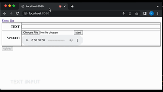

# Minimalistic Speech Text Parallel Data Collection



## Usage

```bash
$ git clone git@github.com:studentofkyoto/min-speech-text.git
$ cd min-speech-text
$ pip install -r requirements.txt
$ python app.py
```

## Author's comments

The goal of this repository is to provide a sample of bare minimum tool for recording text-speech parallel data. If you are considering making a larger dataset, the following are some notable examples:

Free:
- [Aikuma-NG](https://github.com/aikuma/aikuma-ng)
- [Doccano](https://github.com/doccano/doccano)
- [LabelStudio](https://labelstud.io)
- [NVIDIA's Speech Data Explorer](https://docs.nvidia.com/deeplearning/nemo/user-guide/docs/en/stable/tools/speech_data_explorer.html)

Commercial:
- [Audiobee](https://audiobee.ai/speech-data-collection.html)
- [Prodigy](https://prodi.gy)
